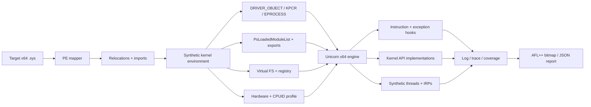

<div align="center">

# KEVLAR

### Kernel Export Virtualization Layer And Runtime

**x64 Windows kernel-driver emulation, behavior analysis, and coverage-guided research harness — powered by Unicorn.**

[](#requirements)
[](#build)
[](https://www.unicorn-engine.org/)
[](https://github.com/zyantific/zydis)
[](#mcp-server)
[](#ci)

[Overview](#overview) • [Architecture](#architecture) • [Capabilities](#capabilities) • [Build](#build) • [Usage](#usage) • [Fuzzing](#coverage--fuzzing) • [Analysis](#structured-analysis-output) • [MCP](#mcp-server) • [Compatibility](#compatibility) • [Layout](#project-layout) • [Limitations](#known-limitations)

</div>

---

## Overview

KEVLAR maps a 64-bit Windows kernel driver into a synthetic kernel address space, resolves its imports into host implementations or controlled stubs, constructs the minimum kernel environment needed, and executes `DriverEntry` inside Unicorn — without loading anything into the live Windows kernel.

It is designed for driver behavior research, anti-cheat analysis, execution tracing, environment-probe reconstruction, and coverage-guided fuzzing of kernel-mode code.

> [!IMPORTANT]
> KEVLAR is a specialized research harness, not a complete Windows virtual machine. A driver reaching the end of `DriverEntry` does not prove correct initialization; many real-world side effects are approximated.

---

## Architecture



---

## Capabilities

### Core emulation

| Area | Detail |
|---|---|
| **Image loading** | x64 PE mapping, full relocation processing, IAT resolution, synthetic kernel base addresses |
| **Kernel environment** | `DRIVER_OBJECT`, `DRIVER_EXTENSION`, KPCR/KPRCB, ETHREAD, EPROCESS, `PsLoadedModuleList`, loader entries |
| **System state** | Real or stubbed system modules, export resolution, `KUSER_SHARED_DATA`, Hyper-V shared page |
| **CPU hooks** | CPUID (coherent Intel bare-metal profile), RDTSC, RDMSR/WRMSR, syscall, interrupts, port I/O |
| **Instruction emulation** | AVX/AVX2 YMM patch-and-dispatch, AES-NI, SHA, CRC32c, RDRAND, RDSEED, XGETBV, PINSR/PEXTR family |
| **Memory** | Pool allocator, variable allocations, MDL/mapped images, user-mode region mapping, physical memory primitives |
| **I/O** | Create/close/cleanup/read/write/IOCTL dispatch; IRP allocation, cancellation, completion routing |
| **Concurrency** | Synthetic system threads with independent Unicorn engines and stacks; APC, DPC, timer delivery |
| **SEH / unwind** | PDATA-guided O(1) frame-chain fast path, fallback linear stack scan, synthetic exception dispatch |
| **State isolation** | Per-driver virtual filesystem and registry trees; named-object registry for AC IPC objects |

### Anti-cheat specific

| Target | Support |
|---|---|
| **EAC** | Primary target; service-path IPC objects, `EOSBin` section, event handles (`--eac-service-emu`) |
| **EOS pipe** | `NtCreateFile` stub intercepts `EOS_AntiCheat_Server` named-pipe paths (`--eos-pipe`) |
| **Vanguard** | Configurable NTSTATUS override map, including all VGK rejection codes (`--override-status`) |
| **BattlEye** | Reported working on tested initialization paths |
| **FACEIT** | Reaches entry point; coherent CPUID bare-metal profile (hypervisor bit clear) |

### Research features

| Feature | Detail |
|---|---|
| **Coverage tracking** | Edge-level coverage with hit counts; per-run snapshots; AFL++ 65536-byte bitmap output |
| **Structured JSON output** | Machine-readable run report: SEH events, memory probes, CPUID, unmapped reads, consistency |
| **Execution tracing** | Deterministic `--trace` record + `--check` replay with divergence detection |
| **Provenance tracing** | `--provenance` records branch decisions and API return values at rejection paths |
| **VTIL devirtualization** | Bounded AMD64→VTIL lift via `kevlar-vtil-host.ps1` (CreateProcessW, 5-min watchdog) |
| **Snapshot / restore** | Full emulator memory checkpoint for zero-overhead fuzz-loop restarts |
| **IRQL enforcement** | Synthetic IRQL tracker; logs calls at wrong IRQL level |
| **ETW provider stubs** | `EtwRegister`/`EtwWrite`/`EtwUnregister` with provider GUID logging |
| **ObReference tracking** | Reference-count lifecycle tracking for fake EPROCESS/ETHREAD objects |
| **PID→name map** | `--pid-map <pid>=<name>` populates realistic `ImageFileName` in fake EPROCESS structs |

---

## Requirements

- Windows x64 (10 / 11)
- Visual Studio 2022 (or Build Tools) with **Desktop development with C++** workload
- Windows 10/11 SDK
- PowerShell 5.1+
- Python 3.11+ *(MCP server only)*

Dependencies managed via `vcpkg.json`:

| Library | Version |
|---|---|
| [Unicorn](https://github.com/unicorn-engine/unicorn) | 2.1.4 |
| [Zydis](https://github.com/zyantific/zydis) | 4.1.1 |
| [Zycore](https://github.com/zyantific/zycore-c) | 1.5.2 |

> **Note on Unicorn symlinks** — The upstream static CMake build creates a symbolic link during packaging, which requires Developer Mode or elevation on Windows. `vcpkg-ports/unicorn/no-symlink.patch` replaces it with a plain file copy. No emulator behavior is changed.

---

## Build

### MSBuild (recommended)

```powershell
Set-ExecutionPolicy -Scope Process Bypass
.\build.ps1 Release
```

```powershell
.\build.ps1 Debug   # includes symbols and diagnostic assertions
```

Outputs land in separate directories so configurations never overwrite each other:

```
builds\Release\KEVLAR.exe
builds\Debug\KEVLAR.exe
```

### CMake

A `CMakeLists.txt` is provided as an alternative for non-MSBuild environments:

```powershell
cmake -B build -DCMAKE_BUILD_TYPE=Release -DCMAKE_TOOLCHAIN_FILE="$env:VCPKG_ROOT/scripts/buildsystems/vcpkg.cmake"
cmake --build build --config Release
```

A `selftest` CMake target is available:

```powershell
cmake --build build --target selftest
```

### CI

GitHub Actions runs a Release build and self-test on every push to `main` / `master` / `ultimate` and on all pull requests. See [`.github/workflows/build.yml`](.github/workflows/build.yml).

---

## Usage

```powershell
.\builds\Release\KEVLAR.exe C:\path\to\driver.sys
```

With full diagnostics and JSON output:

```powershell
.\builds\Release\KEVLAR.exe driver.sys --diag --modreads --json-out report.json
```

Coverage-guided research run:

```powershell
.\builds\Release\KEVLAR.exe driver.sys --afl-bitmap cov.bin --coverage-out run1.cov
```

Compare against a prior run:

```powershell
.\builds\Release\KEVLAR.exe driver.sys --coverage-base run1.cov --coverage-out run2.cov
```

---

### Full option reference

#### Execution control

| Option | Purpose |
|---|---|
| `--max-insns <n>` | Hard instruction budget; disassembles the stopped RIP on limit |
| `--seed <n>` | Deterministic seed for TSC jitter |
| `--no-pause` | Skip final pause; exit ~5 s after a no-thread run (automation) |
| `--workers-deep` | Extended emulation loop for synthetic worker threads |
| `--selftest` | Run IRQL/APC/DPC/timer self-test and exit (no driver required) |

#### Kernel environment

| Option | Purpose |
|---|---|
| `--profile <name\|build>` | Select a built-in Windows build profile |
| `--profile-json <file>` | Load a validated build-profile override from JSON |
| `--module <path>` | Map an additional companion kernel module |
| `--pid-map <pid>=<name>` | Set `ImageFileName` in the fake EPROCESS for a given PID (repeatable) |
| `--inject-hypervideo` | Expose synthetic `hypervideo.sys` in the module list |
| `--target-compat` / `--no-target-compat` | Control exact-version status normalization |

#### Anti-cheat / game security

| Option | Purpose |
|---|---|
| `--eac-service-emu` | Create EAC service IPC objects (`EOSBin` section, event handles) before `DriverEntry` |
| `--eos-pipe` | Intercept `EOS_AntiCheat_Server` `NtCreateFile` paths and serve a synthetic named pipe |
| `--vgk-override` | Alias: adds `0xC0000022→0` and `0xC000007A→0` to the status override map |
| `--override-status <from>=<to>` | Map any `NTSTATUS` return from `DriverEntry` to another (repeatable, hex values) |

#### Diagnostics and tracing

| Option | Purpose |
|---|---|
| `--diag` | Enable structured diagnostic hooks (significantly slower) |
| `--modreads` | Trace reads from mapped system modules |
| `--provenance` | Record branch decisions and API return values at rejection paths |
| `--trace <file>` | Record a deterministic execution trace |
| `--check <file>` | Replay a prior trace; report the first divergence |
| `--json-out <file>` | Write a structured JSON analysis report after the run |
| `--no-seh` | Disable synthetic SEH dispatch |
| `--strict-exports` | Unresolved exports return `STATUS_NOT_IMPLEMENTED` instead of `0` |

#### Coverage and fuzzing

| Option | Purpose |
|---|---|
| `--afl-bitmap <file>` | Write a 65536-byte AFL++/libFuzzer-compatible edge-coverage bitmap |
| `--coverage-out <file>` | Save an edge-coverage snapshot for cross-run comparison |
| `--coverage-base <file>` | Load a prior snapshot; log newly-covered edges in this run |

#### VTIL / devirtualization

| Option | Purpose |
|---|---|
| `--devirt` | Enable devirtualization-testing mode |
| `--vtil-rva <rva>` | Lift a bounded region from the driver image into VTIL |
| `--vtil-size <bytes>` | Byte count available to the lifter (default `0x5000`) |
| `--vtil-out <file>` | Output path for the serialized VTIL (default: exe directory) |

#### Usermode client

| Option | Purpose |
|---|---|
| `--client <script>` | Run a usermode IOCTL client script against the emulated driver |
| `--client-delay <ms>` | Delay before launching the client (default 120 ms) |

---

## Runtime layout

On first launch, KEVLAR downloads PDB symbols for `ntdll.dll` and `ntoskrnl.exe` into `pdb_cache`. Real system modules can be placed beside the executable when a target requires the actual image; otherwise KEVLAR creates bounded stubs.

```
builds/Release/
├── KEVLAR.exe
├── pdb_cache/              # downloaded PDB files
├── kevlar.log              # full run log
├── easyanticheat_threads/  # per-thread logs (one file per synthetic thread)
└── <driver-name>/
    ├── vfs/                # virtual filesystem root
    └── vreg/               # virtual registry root
```

---

## Coverage & Fuzzing

KEVLAR integrates coverage-guided research workflows without modifying the target driver.

### AFL++ bitmap

After a run, `--afl-bitmap <file>` writes a 65536-byte file where each byte represents a unique control-flow edge:

```
byte[StableEdgeId(edge) % 65536] = min(hit_count, 255)
```

This is the standard AFL shared-memory layout. Point AFL++ or a libFuzzer harness at the file to drive input mutation.

### Cross-run comparison

```powershell
# Baseline run
.\KEVLAR.exe driver.sys --coverage-out baseline.cov

# Subsequent run — shows how many new edges were discovered
.\KEVLAR.exe driver.sys --coverage-base baseline.cov --coverage-out run2.cov
```

Log output example:

```
[CYN] Coverage: 142 new edges vs baseline baseline.cov
```

### Snapshot / restore

The `EmulatorSnapshot` subsystem (`KEVLAR/core/snapshot/`) provides full-state checkpointing. After import resolution and kernel-struct setup, a checkpoint can be taken to restart fuzz iterations from a clean pre-`DriverEntry` state in microseconds, without re-mapping the PE or re-initializing pool memory.

---

## Structured Analysis Output

`--json-out <file>` writes a machine-readable report after the run. Only non-empty event categories are included.

```json
{
  "seh": [
    {
      "seq": 1,
      "rip": "0xFFFFF80100001234",
      "exception_code": "0xC0000005",
      "fault_address": "0x0000000000000000"
    }
  ],
  "mem_probes": [...],
  "cpuid": [
    {
      "seq": 4,
      "leaf": "0x1",
      "leaf_name": "FeatureBits",
      "post_eax": "0x000906ED",
      "post_ecx": "0x7FFAB7FF"
    }
  ],
  "unmapped_reads": [...],
  "consistency": [...]
}
```

All addresses are `0x`-prefixed hex strings. Useful for automated diffing between driver versions or builds.

---

## NTSTATUS Override Map

`--override-status` allows any `DriverEntry` return code to be remapped at the host level without patching the driver binary:

```powershell
# Remap VGK access-denied codes to success
.\KEVLAR.exe vgk.sys --override-status 0xC0000022=0x0 --override-status 0xC000007A=0x0

# Equivalent shorthand
.\KEVLAR.exe vgk.sys --vgk-override

# Remap a custom vendor code
.\KEVLAR.exe driver.sys --override-status 0xC0EB0001=0x0
```

Overrides are applied post-emulation: RAX is read from the engine, the map is checked, and if a match exists the new value is written back and the result is promoted to success.

---

## MCP Server

`mcp/kevlar_mcp` is a local stdio [Model Context Protocol](https://modelcontextprotocol.io) server. Every long operation becomes a **persistent run** identified by a run ID, logged under `builds/mcp-runs/`, and readable/cancellable after server restarts.

### Install

```powershell
python -m pip install -e .\mcp
```

### Register with Claude Code

```powershell
claude mcp add kevlar -- python -m kevlar_mcp
```

Or add to `.mcp.json`:

```json
{
  "mcpServers": {
    "kevlar": {
      "command": "python",
      "args": ["-m", "kevlar_mcp"],
      "cwd": "C:\\path\\to\\Kevlar-Ultimate"
    }
  }
}
```

### Tools

| Tool | Purpose |
|---|---|
| `inspect_driver` | PE header/section inspection; SHA-256, machine type, entry point, sections |
| `build_kevlar` | Start a bounded Debug or Release build via `build.ps1`; returns a run record |
| `run_driver` | Execute a staged driver with the full option surface and bounded time/instruction limits |
| `run_selftest` | Run KEVLAR's built-in host-semantics self-test (IRQL, APC, DPC, timers) |
| `generate_test_driver` | Emit a minimal test `.sys` via the repository generator |
| `read_run_log` | Read a bounded UTF-8 chunk of a run log at an offset |
| `list_runs` | List recent runs, optionally filtered by status |
| `cancel_run` | Kill an active process tree by run ID |

### Safety model

- **Path confinement** — inputs resolve only under the Kevlar project root, `C:\Program Files\Alea`, or `C:\Program Files\FACEIT AC`; opened handles are re-verified via `GetFinalPathNameByHandle` to defeat junction/symlink escapes.
- **Bounded execution** — per-run timeout (≤1 h), output cap (≤4 MiB), instruction cap (≤1 × 10⁹), ≤4 concurrent subprocesses; overruns killed via `taskkill /T /F`.
- **Strict schemas** — all requests/responses are Pydantic models with `extra="forbid"`; unknown arguments are rejected at the protocol envelope.
- **Crash hygiene** — a server restart marks in-flight runs as `interrupted` rather than leaving them as phantom `running` records.

---

## Smoke Tests

```powershell
.\tests\smoke.ps1               # build, generate minimal .sys, run, assert STATUS_SUCCESS
.\tests\smoke.ps1 -SkipBuild    # reuse an existing build
```

`tests\make_test_driver.py` emits a minimal x64 native driver that:
- Performs a KPCR/GS read and a conditional branch (exercises the core emulation path)
- Runs a FACEIT-style CPUID probe (leaf `0x1` + `0x40000000`) so `--diag` runs expose the coherent bare-metal profile
- Optionally imports `KeInitializeSpinLock` via `--with-import` to exercise the full `ParseExport` → `ResolveImport` → `BuildSentinelIat` path

---

## Structure Layouts

Kernel structure offsets for the actual target ntoskrnl PDB are generated with the DIA SDK:

```powershell
.\tools\pdb_layout.ps1    # -> generated\kernel_layout.h
```

The harness consumes these through `KEVLAR\include\kernel_layout_consume.h`. Fixed-offset accesses (KPCR→KPRCB→CurrentThread, ETHREAD→KTHREAD back-pointers, APC-disable) use `GEN_*` macros. Compile-time `static_assert`s fail the build if a hardcoded struct drifts from generated offsets.

Regenerate `generated\kernel_layout.h` after refreshing the target ntoskrnl PDB, then rebuild.

---

## Project Layout

```
KEVLAR/
├── api/                        # Emulated kernel API implementations
│   ├── ex/                     # Executive (pool, pushlock, synchronization)
│   ├── io/                     # I/O manager, device, filter manager
│   ├── ke/                     # Kernel (sync, events, timers, ETW, IRQL)
│   ├── mm/                     # Memory manager (pool, virtual, MDL)
│   ├── nt/                     # Native API (file, memory, query, registry)
│   ├── ob/                     # Object manager, callbacks
│   ├── ps/                     # Process/thread manager, token
│   └── rtl/                    # Runtime library (strings, hash, registry)
├── core/
│   ├── coverage/               # Edge coverage tracker + AFL bitmap
│   ├── debug/                  # Logging, bugcheck rendering
│   ├── devirt/                 # VTIL lift integration
│   ├── diagnostics/            # Structured event ring buffers + JSON output
│   ├── exception/              # SEH dispatch + PDATA unwind
│   ├── exec/                   # Unicorn engine, hooks, instruction emulation
│   ├── fuzz/                   # I/O fuzzer
│   ├── hardware/               # PCI bus, IOMMU model
│   ├── io/                     # IRP lifecycle, I/O manager
│   ├── loader/                 # Module loader, kernel structs
│   ├── memory/                 # Guest/host memory management
│   ├── process/                # Synthetic thread management
│   ├── profile/                # Windows build profile system
│   ├── scheduler/              # Virtual thread scheduler
│   └── snapshot/               # Full-state emulator snapshots
├── host/
│   ├── frameworks/             # NDIS, KMDF, storport, fltmgr providers
│   ├── main/                   # CLI entry point (kevlar.cpp)
│   └── providers/              # Export contract runtime, ntoskrnl/usermode providers
└── include/                    # Windows structure definitions, layout macros

libs/                           # Logger, PE mapper, symbol parser
extern/VTIL-NativeLifters/      # Vendored VTIL lifter
mcp/kevlar_mcp/                 # Local stdio MCP server (Python)
vcpkg-ports/                    # Reproducible dependency overlay
tests/                          # Smoke test driver generator + runner
tools/pdb_layout/               # DIA-based kernel layout generator
generated/                      # Generated layout headers
CMakeLists.txt                  # CMake build (alternative to build.ps1)
.github/workflows/build.yml     # CI pipeline
```

---

## Compatibility

| Target | State |
|---|---|
| **EAC** | Primary target; service IPC, `EOSBin` section, named-pipe paths covered |
| **EOS** | `AntiCheat_Server` pipe intercepted; service IPC events registered |
| **BattlEye** | Reported working on tested initialization paths |
| **Vanguard** | Progresses through tested boot-time checks; override map covers all VGK rejection codes |
| **FACEIT** | Reaches entry point; coherent CPUID bare-metal profile; early platform check still rejects |
| **General drivers** | Requires implementations for the exact API paths exercised |

### FACEIT baseline

`FACEIT_AC.sys` and `FACEIT_IOMMU.sys` both reach their entry points and return `0xC0EB0001` after early platform checks: `InitSafeBootMode` read (0), then CPUID leaf `0x1` and hypervisor leaf `0x40000000`. The coherent CPU profile presents a bare-metal surface for exactly those reads — `ECX=0x7FFAB7FF` (hypervisor bit clear), `0x40000000` empty. **No FACEIT compatibility claim is made yet.**

---

## Known Limitations

- Kernel structure definitions are based on Windows 10 21H2 x64. The `_KPROCESS`/`_EPROCESS` bodies predate build 26100; fields not accessed through `GEN_*` macros are not PDB-accurate. Full accuracy requires `pdb_layout` to emit typed struct definitions, not just offsets.
- Many kernel exports are simplified or intentionally stubbed; unknown return values can alter downstream driver control flow.
- Host threads do not perfectly reproduce Windows scheduling, IRQL behavior, or quantum accounting.
- ACPI/PCI/IOMMU model is a bounded baseline: synthetic PCI config, VT-d `DMAR` table, `0xFED90000` register block, and CPUID/MSR pre-conditions. The register set is still minimal until a real IOMMU driver trace validates it.
- PnP, power, DMA, and filter stacks are present but simplified; they are extended only when a specific target driver exercises a given path.
- Diagnostic mode (`--diag`) produces large traces and runs substantially slower.
- `KeWaitForMultipleObjects` `WaitAll` / `WaitAny` paths are implemented; complex cross-object wait chains with arbitrary timeout types may still fall back to simplified behavior.
- APC delivery runs inline on the target thread's own engine and stack. Cross-thread APC signals a per-thread wake event so a wait-blocked thread is interrupted and delivers in its wait loop.

---

## Credits

- **TheRealWaryas** — KACE, which inspired the project's early design
- **Unicorn Engine** — CPU emulation core
- **Zydis / Zycore** — x86/x64 instruction decoding

---

## License

No license file was included in the source archive. Publication of this repository does not add or imply a new license; original authors retain their applicable rights.
