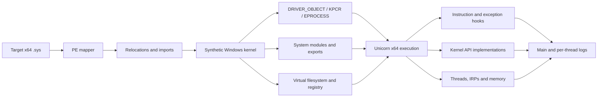

<div align="center">

# 🛡️ KEVLAR

### Kernel Export Virtualization Layer And Runtime

**An x64 Windows kernel-driver emulation and behavior-analysis harness powered by Unicorn — with a local MCP server for agent-driven builds and runs.**

[](#requirements)
[](#build)
[](https://www.unicorn-engine.org/)
[](#mcp-server)

[Overview](#overview) • [Architecture](#architecture) • [Build](#build) • [Usage](#usage) • [MCP](#mcp-server) • [Compatibility](#compatibility) • [Limitations](#known-limitations)

</div>

---

## Overview

KEVLAR maps a 64-bit Windows kernel driver into a synthetic kernel address space, resolves its imports into host implementations or controlled stubs, builds the minimum kernel environment it needs, and executes `DriverEntry` inside Unicorn — without loading the target driver into the live Windows kernel.

It is designed for driver behavior research, execution tracing, environment-probe analysis, and iterative reconstruction of missing kernel semantics.

> [!IMPORTANT]
> KEVLAR is a specialized research harness, not a complete Windows virtual machine. A driver reaching the end of `DriverEntry` does not prove that its returned `NTSTATUS` indicates successful initialization.

## Architecture



## Capabilities

| Area | Implemented behavior |
|---|---|
| **Image loading** | x64 PE mapping, relocations, import resolution and synthetic kernel addresses |
| **Kernel environment** | `DRIVER_OBJECT`, `DRIVER_EXTENSION`, KPCR/KPRCB, ETHREAD, EPROCESS and loader entries |
| **System state** | `PsLoadedModuleList`, real or stubbed modules, exports and `KUSER_SHARED_DATA` |
| **Execution** | Unicorn x64 emulation with custom unsupported-instruction handling |
| **CPU hooks** | CPUID, RDTSC, RDMSR, WRMSR, syscall, interrupts and port I/O |
| **Instructions** | Additional AVX, AES, SHA and CRC instruction emulation |
| **Memory** | Pool, variable, user-mode and mapped-image memory management |
| **I/O** | Create, close, cleanup, read, write and IOCTL dispatch paths |
| **State isolation** | Per-driver virtual filesystem and registry trees |
| **Diagnostics** | Module reads, PE probes, exceptions, firmware, CPUID, timing and unmapped-memory tracing |
| **Concurrency** | Synthetic system threads with independent Unicorn engines and stacks |

## Requirements

- Windows x64
- Visual Studio 2022 Build Tools or Visual Studio 2022
- **Desktop development with C++** workload
- Windows 10/11 SDK
- PowerShell 5.1 or newer
- Python 3.11+ (only for the MCP server)

Dependencies are pinned through `vcpkg.json`:

- [Unicorn 2.1.4](https://github.com/unicorn-engine/unicorn)
- [Zydis 4.1.1](https://github.com/zyantific/zydis)
- [Zycore 1.5.2](https://github.com/zyantific/zycore-c)

## Build

The build script locates Visual Studio, restores the static x64 dependencies, and builds the solution:

```powershell
Set-ExecutionPolicy -Scope Process Bypass
.\build.ps1 Release
```

Build Debug when diagnostics and symbols are required:

```powershell
.\build.ps1 Debug
```

Outputs are separated to prevent Debug and Release configurations from overwriting each other:

```text
builds\Release\KEVLAR.exe
builds\Debug\KEVLAR.exe
```

### Why is there a Unicorn overlay port?

The upstream Unicorn 2.1.4 static CMake build creates a symbolic link during packaging. On Windows that operation requires Developer Mode or elevated symlink privileges. `vcpkg-ports/unicorn/no-symlink.patch` replaces it with an ordinary file copy; no emulator behavior is changed.

## Usage

```powershell
.\builds\Release\KEVLAR.exe C:\path\to\driver.sys
```

Enable focused diagnostics:

```powershell
.\builds\Release\KEVLAR.exe C:\path\to\driver.sys --diag --modreads
```

### Options

| Option | Purpose |
|---|---|
| `--diag` | Enable detailed diagnostic hooks; significantly slower |
| `--modreads` | Trace reads from mapped system modules |
| `--no-seh` | Disable synthetic SEH dispatch |
| `--intel` | Accepted for compatibility; the coherent Intel profile is always active |
| `--profile <name>` | Select a named hardware/platform profile |
| `--profile-json <file>` | Load a custom platform profile from JSON |
| `--seed <n>` | Deterministic seed for TSC jitter (default is fixed) |
| `--max-insns <n>` | Hard instruction budget for the run |
| `--strict-exports` | Unhandled exports return `STATUS_NOT_IMPLEMENTED` instead of `0` |
| `--devirt` | Enable devirtualization-testing behavior |
| `--provenance` | Trace branch decisions + API results for early rejection paths |
| `--trace <file>` | Record a deterministic execution trace |
| `--check <file>` | Replay a trace; report the first divergence |
| `--vgk-override` | Convert the configured VGK access-denied result to success |
| `--workers-deep` | Deep synthetic worker-thread expansion |
| `--eac-service-emu` | Enable EAC service-path emulation |
| `--inject-hypervideo` | Inject the `hypervideo.sys` surface into the module list |
| `--target-compat` / `--no-target-compat` | Control exact-version target-compat status normalization |
| `--client <file>` / `--client-delay <ms>` | Drive a usermode IOCTL client against the emulated driver |
| `--module <name>=<file>` | Substitute a real system module image |
| `--selftest` | Run the IRQL/APC/DPC/timer self-test and exit (no driver needed) |
| `--no-pause` | Skip the final pause; exit ~5s after a no-thread run (automation) |

### Runtime layout

On first launch, KEVLAR downloads NTDLL and NTOSKRNL symbols into `pdb_cache`. Real system modules can be placed beside the executable when a target requires their actual image; otherwise KEVLAR creates bounded module stubs.

```text
builds/Release/
├── KEVLAR.exe
├── pdb_cache/
├── kevlar.log
├── easyanticheat_threads/
└── <driver>/
    ├── vfs/
    └── vreg/
```

## MCP server

`mcp/kevlar_mcp` ships a local stdio [Model Context Protocol](https://modelcontextprotocol.io) server that wraps building, driver execution, self-testing, and run inspection behind bounded, auditable tools. Every long operation becomes a **persistent run** — identified by a run ID, logged to disk under `builds/mcp-runs/`, and readable/cancellable later, even after the server restarts.

### Install

```powershell
python -m pip install -e .\mcp
```

### Register with Claude Code

```powershell
claude mcp add kevlar -- python -m kevlar_mcp
```

Or add the equivalent entry to `.mcp.json`:

```json
{
  "mcpServers": {
    "kevlar": {
      "command": "python",
      "args": ["-m", "kevlar_mcp"],
      "cwd": "C:\\path\\to\\Kevlar-Ultimate"
    }
  }
}
```

### Tools

| Tool | Purpose |
|---|---|
| `inspect_driver` | PE header/section inspection of an allowlisted `.sys` through a server-staged copy (SHA-256, machine, sections, entry point) |
| `build_kevlar` | Start a bounded Debug or Release build via `build.ps1`; returns a run record |
| `run_driver` | Execute one staged driver with bounded time/instructions and the full switch surface |
| `run_selftest` | Run KEVLAR's built-in host-semantics self-test |
| `generate_test_driver` | Emit a minimal test `.sys` through the repository's fixed generator |
| `read_run_log` | Read a bounded UTF-8 chunk of a run's log at an offset |
| `list_runs` | List recent runs, optionally filtered by status |
| `cancel_run` | Kill an active process tree by run ID; completed runs are untouched |

### Safety model

- **Path confinement** — inputs resolve only under the Kevlar project root, `C:\Program Files\Alea`, or `C:\Program Files\FACEIT AC`; opened handles are re-verified via `GetFinalPathNameByHandle` to defeat junction/symlink escapes. Generated outputs (`.sys`, `.trace`) are server-owned files under `builds/mcp-runs/`.
- **Bounded execution** — per-run timeout (≤1 h), output cap (≤4 MiB), instruction cap (≤1e9), and at most 4 concurrent subprocesses. Overruns are killed via `taskkill /T /F` with explicit `timed_out` / `termination_failed` statuses.
- **Strict schemas** — every request/response is a Pydantic model with `extra="forbid"`; unknown tool arguments are rejected at the protocol envelope, not silently ignored.
- **Crash hygiene** — a server restart marks runs that were mid-flight as `interrupted` instead of leaving them as phantom `running` records.
- **Honest statuses** — `analysis_only` is reported for `--target-compat` runs; target-compat status normalization never claims complete emulation (`emulation_complete` stays false unless the driver's own lifecycle markers say otherwise).

## Compatibility

Compatibility is path- and version-specific. Results beyond `DriverEntry` depend on the APIs and kernel behavior exercised by each driver.

| Target family | Current state |
|---|---|
| EAC | Primary target of the original implementation |
| BattlEye | Reported working on tested initialization paths |
| Vanguard | Reported to progress through tested boot-time checks |
| FACEIT | Images map and execute; current drivers reject the synthetic environment early |
| General drivers | Requires implementations for the exact paths exercised |

### Current FACEIT baseline

The locally tested FACEIT drivers (`FACEIT_AC.sys`, `FACEIT_IOMMU.sys`) both reach their entry points and return the same vendor-specific failure, `0xC0EB0001`, after early platform checks: an `InitSafeBootMode` read (0), then `CPUID` leaf `0x1` and hypervisor leaf `0x40000000`. The coherent CPU profile now presents a bare-metal surface for exactly those reads — leaf `0x1` `ECX=0x7FFAB7FF` (hypervisor bit clear), `0x40000000` empty — verified by the CPUID probe in the smoke driver. The bounded ACPI/PCI/IOMMU model and VT-d advertisement in the CPUID/MSR surface back the IOMMU path. A fresh `FACEIT_IOMMU.sys` run against the current build is still required to confirm the next rejection point; **no FACEIT compatibility claim is made yet.**

## Project layout

```text
KEVLAR/
├── api/                    # Emulated kernel API implementations
├── core/
│   ├── debug/              # Logging, rendering and bugcheck diagnostics
│   ├── diagnostics/        # Structured execution observations
│   ├── exception/          # SEH and unwind support
│   ├── exec/               # Unicorn engine, hooks and instruction emulation
│   ├── io/                 # IRP and I/O manager behavior
│   ├── loader/             # Modules and synthetic kernel structures
│   ├── memory/             # Guest/host memory mapping
│   ├── process/            # Synthetic threading
│   └── registry/           # Virtual filesystem and registry
├── host/                   # CLI, providers and host configuration
└── include/                # Windows definitions and structure layouts

libs/                      # Logger, PE mapper and symbol parser
extern/                    # Vendored public headers
mcp/kevlar_mcp/            # Local stdio MCP server (Python)
vcpkg-ports/               # Reproducible dependency overlay
tests/                     # Smoke test driver generator + runner
tools/pdb_layout/          # DIA-based kernel structure layout generator
generated/                 # Generated layout headers (pdb_layout output)
```

## Smoke tests and layout generation

Automated smoke tests cover PE mapping and emulator initialization end-to-end:

```powershell
.\tests\smoke.ps1                 # builds, generates a minimal .sys, runs, asserts
.\tests\smoke.ps1 -SkipBuild      # reuse an existing build
```

`tests\make_test_driver.py` emits a minimal x64 native driver (no imports, a KPCR/GS read, a conditional branch) that must return `STATUS_SUCCESS` for the test to pass. It first runs the FACEIT-style CPUID probe (leaf `0x1` + `0x40000000`) so `--diag` runs show the coherent bare-metal profile values. `--with-import` adds a single `ntoskrnl.exe!KeInitializeSpinLock` import so the full import-resolution path (`ParseExport` on ntoskrnl, `ResolveImport`, `BuildSentinelIat`) is exercised end-to-end.

Structure layouts for the actual target ntoskrnl PDB are generated with the DIA SDK:

```powershell
.\tools\pdb_layout.ps1            # -> generated\kernel_layout.h (GEN_<STRUCT>_<FIELD> defines)
```

The harness consumes these generated offsets through `KEVLAR\include\kernel_layout_consume.h`: fixed-offset accesses (KPCR→KPRCB→CurrentThread, ETHREAD→KTHREAD back-pointers, EPROCESS rundown-protect, APC-disable) are sourced from the `GEN_*` macros, the synthetic ETHREAD layout is kept at the PDB size (KTHREAD tail padding in `ntoskrnl_struct.h`), and compile-time `static_assert`s fail the build if a hardcoded struct drifts from the generated offsets. Regenerate `generated\kernel_layout.h` after refreshing the target ntoskrnl PDB and rebuild.

## Known limitations

- The included kernel structure definitions are based primarily on Windows 10 21H2 x64, with the harness-consumed offsets (ETHREAD/KTHREAD/KPCR/KPRCB and the fixed-offset accesses) tracked against the generated layout from the cached ntoskrnl PDB. The hardcoded `_KPROCESS`/`_EPROCESS` bodies predate the target build (e.g. `UniqueProcessId` at `0x440` vs `0x1D0` on 26100), so EPROCESS fields other than the ones the harness populates through the `GEN_` accessors are not PDB-accurate; full accuracy needs `pdb_layout` to emit typed struct definitions rather than offsets.
- Many kernel exports are simplified or intentionally stubbed; unknown return values can alter downstream control flow.
- Host threads do not perfectly reproduce Windows scheduling and IRQL behavior.
- Kernel APCs deliver on the target thread's own context: `KernelRoutine`/`NormalRoutine` run inline on the target's engine (current ETHREAD/KPCR/stack are the target's), and a cross-thread APC signals a per-thread wake event so a wait-blocked thread is interrupted and delivers it in its wait loop instead of at an arbitrary future delivery point.
- The ACPI/PCI/IOMMU model is a bounded baseline: synthetic PCI config, a VT-d `DMAR` table, a coherent `0xFED90000` register block, and a CPUID/MSR surface that advertises the virtualization pre-conditions (`IA32_FEATURE_CONTROL` VMX-enabled, a valid `IA32_VMX_BASIC`). The register set is still minimal until a real IOMMU driver trace validates it.
- PnP, power, DMA, filter stacks and real device behavior are present but simplified (`IoCreateDevice`, `IoRegisterPlugPlayNotification`, `IofCompleteRequest`, MDL/DMA and contiguous-memory providers exist). They are extended only when a specific target driver is seen exercising a given path.
- Diagnostic mode can produce large traces and run substantially slower.
- Import resolution is fixed: `ParseExport` bounds-checks every export-table read, `GetExport`/`GetImport` use single lookups, and `ResolveImport` no longer crashes on a missing import module or ordinal thunk. A driver importing from a real cached `ntoskrnl.exe` resolves its IAT through `BuildSentinelIat`; coverage lives in `make_test_driver.py --with-import`.

## Credits

- **TheRealWaryas** — KACE, which inspired the project's early development
- **Unicorn Engine** — CPU emulation
- **Zydis / Zycore** — x86/x64 instruction decoding and support

## License

The source archive did not include a license file. Publication of this repository does not add or imply a new license; original authors retain their applicable rights.
